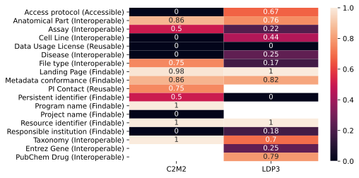

# LINCS FAIR Assessment Summary
We investigate the assessment results using the [C2M2 assessment](./figures/https://github.com/nih-cfde/FAIR/tree/master/Demos/FAIRAssessment/c2m2)
on the LINCS metadata C2M2 serializations and a custom [FAIR Assessment](./figures/https://github.com/nih-cfde/LINCS-metadata/tree/main/FAIRAssessment/c2m2) directly on the LINCS LDP3 metadata.

## Step 1. Perform FAIR Assessement on LINCS C2M2 Datapackage using [C2M2 assessment](./figures/https://github.com/nih-cfde/FAIR/tree/master/Demos/FAIRAssessment/c2m2).
```bash
# Get LINCS-metadata
git clone https://github.com/nih-cfde/LINCS-metadata.git
# Get C2M2 Assessment
git clone https://github.com/nih-cfde/FAIR.git
# Perform C2M2 assessment on LINCS-metadata
python3.8 ./FAIR/Demos/FAIRAssessment/c2m2/assess.py -i ./LINCS-metadata/c2m2_level1/datapackage.json -o c2m2.jsonl
```


```python
import json
from pydoc import describe
import requests
import pandas as pd
import seaborn as sns

def get_first(obj, *K):
  for k in K:
    if obj.get(k):
      return obj[k]
  return None

```


```python
metric_id_to_name = {
  27: 'PI Contact (Reusable)',
  104: 'Persistent identifier (Findable)',
  106: 'Metadata conformance (Findable)',
  108: 'Resource identifier (Findable)',
  110: 'Access protocol (Accessible)',
  116: 'Data Usage License (Reusable)',
  136: 'Program name (Findable)',
  137: 'Project name (Findable)',
  138: 'Responsible institution (Findable)',
  139: 'Assay (Interoperable)',
  140: 'Anatomical Part (Interoperable)',
  141: 'Disease (Interoperable)',
  142: 'File type (Interoperable)',
  143: 'Taxonomy (Interoperable)',
  144: 'Cell Line (Interoperable)',
  145: 'Landing Page (Findable)',
  310: 'PubChem Drug (Interoperable)',
  311: 'Entrez Gene (Interoperable)',
}

```


```python
def preprocess_c2m2(assessment, answer):
  ''' Flatten assessment/answer into something introspectable with a pandas dataframe
  '''
  import re
  if type(answer['metric']['@id']) == list:
    principle = re.match(r'^.+\((.+)\)$', metric_id_to_name[answer['metric']['@id']][0]).group(1)
  else:
    principle = re.match(r'^.+\((.+)\)$', metric_id_to_name[answer['metric']['@id']]).group(1)
  #
  return {
    'id': assessment['id'],
    'target': assessment['id'],
    'title': (assessment['target']['filename'] + ' (' + assessment['id'] + ')') if assessment['target'].get('filename') else assessment['id'],
    'metric_id': answer['metric']['@id'],
    'metric': metric_id_to_name[answer['metric']['@id']],
    'principle': principle,
    'value': answer['answer'].get('value', 0),
    'comment': answer['answer'].get('comment', ''),
    'url_comment': answer['answer'].get('url_comment', ''),
  }

with open('c2m2.jsonl', 'r') as fr:
  c2m2 = pd.DataFrame([
      preprocess_c2m2(assessment, answer)
      for assessment in map(json.loads, fr)
      if assessment and assessment.get('answers')
      for answer in assessment['answers']
  ])

c2m2

```


<div>
<style scoped>
    .dataframe tbody tr th:only-of-type {
        vertical-align: middle;
    }

    .dataframe tbody tr th {
        vertical-align: top;
    }

    .dataframe thead th {
        text-align: right;
    }
</style>
<table border="1" class="dataframe">
  <thead>
    <tr style="text-align: right;">
      <th></th>
      <th>id</th>
      <th>target</th>
      <th>title</th>
      <th>metric_id</th>
      <th>metric</th>
      <th>principle</th>
      <th>value</th>
      <th>comment</th>
      <th>url_comment</th>
    </tr>
  </thead>
  <tbody>
    <tr>
      <th>0</th>
      <td>http://www.lincsproject.org/LDS-1176</td>
      <td>http://www.lincsproject.org/LDS-1176</td>
      <td>LDS-1176_1.1.tar.gz (http://www.lincsproject.o...</td>
      <td>106</td>
      <td>Metadata conformance (Findable)</td>
      <td>Findable</td>
      <td>0.807143</td>
      <td>Computed based on completeness of file (0.80) ...</td>
      <td></td>
    </tr>
    <tr>
      <th>1</th>
      <td>http://www.lincsproject.org/LDS-1176</td>
      <td>http://www.lincsproject.org/LDS-1176</td>
      <td>LDS-1176_1.1.tar.gz (http://www.lincsproject.o...</td>
      <td>136</td>
      <td>Program name (Findable)</td>
      <td>Findable</td>
      <td>1.000000</td>
      <td>Identified known program LINCS</td>
      <td></td>
    </tr>
    <tr>
      <th>2</th>
      <td>http://www.lincsproject.org/LDS-1176</td>
      <td>http://www.lincsproject.org/LDS-1176</td>
      <td>LDS-1176_1.1.tar.gz (http://www.lincsproject.o...</td>
      <td>137</td>
      <td>Project name (Findable)</td>
      <td>Findable</td>
      <td>0.000000</td>
      <td>No project found</td>
      <td></td>
    </tr>
    <tr>
      <th>3</th>
      <td>http://www.lincsproject.org/LDS-1176</td>
      <td>http://www.lincsproject.org/LDS-1176</td>
      <td>LDS-1176_1.1.tar.gz (http://www.lincsproject.o...</td>
      <td>27</td>
      <td>PI Contact (Reusable)</td>
      <td>Reusable</td>
      <td>0.750000</td>
      <td>Contact email found, possibly PI</td>
      <td></td>
    </tr>
    <tr>
      <th>4</th>
      <td>http://www.lincsproject.org/LDS-1176</td>
      <td>http://www.lincsproject.org/LDS-1176</td>
      <td>LDS-1176_1.1.tar.gz (http://www.lincsproject.o...</td>
      <td>138</td>
      <td>Responsible institution (Findable)</td>
      <td>Findable</td>
      <td>0.000000</td>
      <td>No information about the contributing institut...</td>
      <td></td>
    </tr>
    <tr>
      <th>...</th>
      <td>...</td>
      <td>...</td>
      <td>...</td>
      <td>...</td>
      <td>...</td>
      <td>...</td>
      <td>...</td>
      <td>...</td>
      <td>...</td>
    </tr>
    <tr>
      <th>24509791</th>
      <td>http://www.lincsproject.org/L1000_LINCS_DCIC_2...</td>
      <td>http://www.lincsproject.org/L1000_LINCS_DCIC_2...</td>
      <td>L1000_LINCS_DCIC_ZTO.XPR001_U937_408H_N13_NIPB...</td>
      <td>144</td>
      <td>Cell Line (Interoperable)</td>
      <td>Interoperable</td>
      <td>0.000000</td>
      <td>Cell line found but missing any information</td>
      <td></td>
    </tr>
    <tr>
      <th>24509792</th>
      <td>http://www.lincsproject.org/L1000_LINCS_DCIC_2...</td>
      <td>http://www.lincsproject.org/L1000_LINCS_DCIC_2...</td>
      <td>L1000_LINCS_DCIC_ZTO.XPR001_U937_408H_N13_NIPB...</td>
      <td>116</td>
      <td>Data Usage License (Reusable)</td>
      <td>Reusable</td>
      <td>0.000000</td>
      <td>No information about data usage licenses are d...</td>
      <td></td>
    </tr>
    <tr>
      <th>24509793</th>
      <td>http://www.lincsproject.org/L1000_LINCS_DCIC_2...</td>
      <td>http://www.lincsproject.org/L1000_LINCS_DCIC_2...</td>
      <td>L1000_LINCS_DCIC_ZTO.XPR001_U937_408H_N13_NIPB...</td>
      <td>104</td>
      <td>Persistent identifier (Findable)</td>
      <td>Findable</td>
      <td>0.500000</td>
      <td>A persistent_id was identified but it is not a...</td>
      <td>https://lincs-dcic.s3.amazonaws.com/LINCS-data...</td>
    </tr>
    <tr>
      <th>24509794</th>
      <td>http://www.lincsproject.org/L1000_LINCS_DCIC_2...</td>
      <td>http://www.lincsproject.org/L1000_LINCS_DCIC_2...</td>
      <td>L1000_LINCS_DCIC_ZTO.XPR001_U937_408H_N13_NIPB...</td>
      <td>108</td>
      <td>Resource identifier (Findable)</td>
      <td>Findable</td>
      <td>1.000000</td>
      <td>An id and namespace were provided for the reso...</td>
      <td>L1000_LINCS_DCIC_2021_ZTO.XPR001_U937_408H_N13...</td>
    </tr>
    <tr>
      <th>24509795</th>
      <td>http://www.lincsproject.org/L1000_LINCS_DCIC_2...</td>
      <td>http://www.lincsproject.org/L1000_LINCS_DCIC_2...</td>
      <td>L1000_LINCS_DCIC_ZTO.XPR001_U937_408H_N13_NIPB...</td>
      <td>145</td>
      <td>Landing Page (Findable)</td>
      <td>Findable</td>
      <td>1.000000</td>
      <td>valid and HEAD reports 200</td>
      <td>https://lincs-dcic.s3.amazonaws.com/LINCS-data...</td>
    </tr>
  </tbody>
</table>
<p>24509796 rows × 9 columns</p>
</div>


```python
current = c2m2.groupby(['metric'])['value'].mean()
current

```


    metric
    Access protocol (Accessible)          0.000000
    Anatomical Part (Interoperable)       0.863031
    Assay (Interoperable)                 0.500007
    Cell Line (Interoperable)             0.000000
    Data Usage License (Reusable)         0.000000
    Disease (Interoperable)               0.000000
    File type (Interoperable)             0.750000
    Landing Page (Findable)               0.983531
    Metadata conformance (Findable)       0.856166
    PI Contact (Reusable)                 0.750000
    Persistent identifier (Findable)      0.500000
    Program name (Findable)               1.000000
    Project name (Findable)               0.000000
    Resource identifier (Findable)        1.000000
    Responsible institution (Findable)    0.000000
    Taxonomy (Interoperable)              1.000000
    Name: value, dtype: float64


```python
# Our persistent_ids are not DOIs, but this metric is likely to become less specific in the future
c2m2[c2m2['metric'] == 'Persistent identifier (Findable)']['comment'].value_counts()

```


    A persistent_id was identified but it is not a doi    1455069
    Name: comment, dtype: int64


```python
# seems to be an issue with file formats
c2m2[c2m2['metric'] == 'File type (Interoperable)']['comment'].value_counts()

```


    Ontological IRI for data type found in EDAM.    1455069
    File format found but not verified in EDAM.     1455069
    Name: comment, dtype: int64


```python
c2m2[c2m2['metric'] == 'File type (Interoperable)']['url_comment'].value_counts()

```


    format:3475    1454799
    data:0928      1454587
    data:1566          306
    format:3751        243
    data:2968           94
    data:2603           56
    data:2536           19
    format:3752          9
    format:3612          7
    data:3002            7
    format:3709          6
    format:3620          5
    Name: url_comment, dtype: int64


```python
# The types of errors causing these values to not be 1
c2m2[c2m2['metric'] == 'Landing Page (Findable)']['comment'].value_counts()

```


    valid and HEAD reports 200         1423118
    valid url but HEAD reported 404      31939
    valid url but HEAD reported 500         12
    Name: comment, dtype: int64


```python
# 404s seem problematic, we need to investigate why these files are missing
c2m2[((c2m2['metric'] == 'Landing Page (Findable)') & (c2m2['comment'] == 'valid url but HEAD reported 404'))]['url_comment'].value_counts()

```


    https://lincs-dcic.s3.amazonaws.com/LINCS-data-phase-2/L1000/L1000_LINCS_DCIC_REP.A022_HELA_24H_J11_acexamic-acid_0.12um.tsv.gz    1
    https://lincs-dcic.s3.amazonaws.com/LINCS-data-phase-2/L1000/L1000_LINCS_DCIC_LJP005_MDAMB231_3H_I20_torin-2_3.33um.tsv.gz         1
    https://lincs-dcic.s3.amazonaws.com/LINCS-data-phase-2/L1000/L1000_LINCS_DCIC_REP.A011_HT29_24H_B23_favipiravir_0.12um.tsv.gz      1
    https://lincs-dcic.s3.amazonaws.com/LINCS-data-phase-2/L1000/L1000_LINCS_DCIC_XPR002_HA1E.311_96H_G02_PFDN2_2.00uL.tsv.gz          1
    https://lincs-dcic.s3.amazonaws.com/LINCS-data-phase-2/L1000/L1000_LINCS_DCIC_XPR002_PC3.101_96H_F09_HDAC3_2.00uL.tsv.gz           1
                                                                                                                                      ..
    https://lincs-dcic.s3.amazonaws.com/LINCS-data-phase-2/L1000/L1000_LINCS_DCIC_LJP007_JURKAT_24H_J23_doramapimod_0.12um.tsv.gz      1
    https://lincs-dcic.s3.amazonaws.com/LINCS-data-phase-2/L1000/L1000_LINCS_DCIC_LJP006_HME1_24H_C13_fostamatinib_10.00um.tsv.gz      1
    https://lincs-dcic.s3.amazonaws.com/LINCS-data-phase-2/L1000/L1000_LINCS_DCIC_REP.A002_YAPC_24H_I01_pibenzimol_10.00um.tsv.gz      1
    https://lincs-dcic.s3.amazonaws.com/LINCS-data-phase-2/L1000/L1000_LINCS_DCIC_REP.A010_A375_24H_H11_doxazosin_0.12um.tsv.gz        1
    https://lincs-dcic.s3.amazonaws.com/LINCS-data-phase-2/L1000/L1000_LINCS_DCIC_REP.A025_HELA_24H_K19_vandetanib_10.00um.tsv.gz      1
    Name: url_comment, Length: 31939, dtype: int64


```python
# when checked manually, the 500s seem to work -- perhaps there was momentary interruption during the assessment.
c2m2[((c2m2['metric'] == 'Landing Page (Findable)') & (c2m2['comment'] == 'valid url but HEAD reported 500'))]['url_comment'].value_counts()

```


    https://lincs-dcic.s3.amazonaws.com/LINCS-data-phase-1/L1000/L1000_LINCS_DCIC_CPC007_HA1E_6H_C05_BRD-K27074404_10.00um.tsv.gz              1
    https://lincs-dcic.s3.amazonaws.com/LINCS-data-2020/L1000/ctl/L1000_LINCS_DCIC_DOS017_VCAP_6H_H03_DMSO.tsv.gz                              1
    https://lincs-dcic.s3.amazonaws.com/LINCS-data-2020/L1000/compound/L1000_LINCS_DCIC_DOS054_MCF7_24H_L22_BRD-K69306987_4uM.tsv.gz           1
    https://lincs-dcic.s3.amazonaws.com/LINCS-data-2020/L1000/shRNA/L1000_LINCS_DCIC_ERGK003_VCAP_120H_G12_PIP4K2C.tsv.gz                      1
    https://lincs-dcic.s3.amazonaws.com/LINCS-data-2020/L1000/compound/L1000_LINCS_DCIC_PAC044_U2OS_6H_E04_BRD-K42679345_10uM.tsv.gz           1
    https://lincs-dcic.s3.amazonaws.com/LINCS-data-phase-2/L1000/L1000_LINCS_DCIC_LJP009_HT29_24H_M23_MGCD-265_0.12um.tsv.gz                   1
    https://lincs-dcic.s3.amazonaws.com/LINCS-data-phase-1/L1000/L1000_LINCS_DCIC_KDA008_PC3_144H_E03_MYCL1.tsv.gz                             1
    https://lincs-dcic.s3.amazonaws.com/LINCS-data-2020/L1000/shRNA/L1000_LINCS_DCIC_KDC010_A549_96H_K08_MSL3.tsv.gz                           1
    https://lincs-dcic.s3.amazonaws.com/LINCS-data-phase-2/L1000/L1000_LINCS_DCIC_REP.A028_HELA_24H_I23_nisoxetine_0.12um.tsv.gz               1
    https://lincs-dcic.s3.amazonaws.com/LINCS-data-2020/L1000/compound/L1000_LINCS_DCIC_PBIOA005_XC.L10_24H_O23_BRD-K36208737_3.33uM.tsv.gz    1
    https://lincs-dcic.s3.amazonaws.com/LINCS-data-2020/L1000/compound/L1000_LINCS_DCIC_LJP009_HEPG2_24H_C17_QL-XI-92_0.12uM.tsv.gz            1
    https://lincs-dcic.s3.amazonaws.com/LINCS-data-2020/L1000/compound/L1000_LINCS_DCIC_CEGS002_HIMG002_24H_O24_doxycycline_40uM.tsv.gz        1
    Name: url_comment, dtype: int64


## Step 2. Compare C2M2 Assessment summary with historic assessments using this rubric


```python
# Load historic assessment summaries
df = pd.read_csv('../../FAIR/Demos/FAIRAssessment/report/2020_12_15_output_summary.tsv', sep='\t')
past = df[df['project']=='LINCS'].groupby(['label', 'metric'])['value'].first().unstack('label')
pd.concat([
    past,
    current.to_frame('June 2021'),
], axis=1)[[
    'October 2019',
    'September 2020',
    'March 2020',
    'June 2020',
    'December 2020',
    'June 2021',
]]

```


<div>
<style scoped>
    .dataframe tbody tr th:only-of-type {
        vertical-align: middle;
    }

    .dataframe tbody tr th {
        vertical-align: top;
    }

    .dataframe thead th {
        text-align: right;
    }
</style>
<table border="1" class="dataframe">
  <thead>
    <tr style="text-align: right;">
      <th></th>
      <th>October 2019</th>
      <th>September 2020</th>
      <th>March 2020</th>
      <th>June 2020</th>
      <th>December 2020</th>
      <th>June 2021</th>
    </tr>
    <tr>
      <th>metric</th>
      <th></th>
      <th></th>
      <th></th>
      <th></th>
      <th></th>
      <th></th>
    </tr>
  </thead>
  <tbody>
    <tr>
      <th>Access protocol (Accessible)</th>
      <td>0.985528</td>
      <td>0.000000</td>
      <td>0.990099</td>
      <td>1.000000</td>
      <td>0.000000</td>
      <td>0.000000</td>
    </tr>
    <tr>
      <th>Anatomical Part (Interoperable)</th>
      <td>0.000000</td>
      <td>0.950332</td>
      <td>0.000000</td>
      <td>0.536398</td>
      <td>0.983974</td>
      <td>0.863031</td>
    </tr>
    <tr>
      <th>Assay (Interoperable)</th>
      <td>0.242826</td>
      <td>0.971373</td>
      <td>0.241667</td>
      <td>0.984674</td>
      <td>0.500055</td>
      <td>0.500007</td>
    </tr>
    <tr>
      <th>Cell Line (Interoperable)</th>
      <td>0.000000</td>
      <td>0.000000</td>
      <td>0.000000</td>
      <td>0.000000</td>
      <td>0.000000</td>
      <td>0.000000</td>
    </tr>
    <tr>
      <th>Data Usage License (Reusable)</th>
      <td>0.000000</td>
      <td>0.000000</td>
      <td>0.000000</td>
      <td>0.000000</td>
      <td>0.000000</td>
      <td>0.000000</td>
    </tr>
    <tr>
      <th>Disease (Interoperable)</th>
      <td>0.000000</td>
      <td>0.000000</td>
      <td>0.000000</td>
      <td>0.000000</td>
      <td>0.000000</td>
      <td>0.000000</td>
    </tr>
    <tr>
      <th>File type (Interoperable)</th>
      <td>0.086831</td>
      <td>0.000000</td>
      <td>0.059406</td>
      <td>0.000000</td>
      <td>0.999907</td>
      <td>0.750000</td>
    </tr>
    <tr>
      <th>Landing Page (Findable)</th>
      <td>1.000000</td>
      <td>1.000000</td>
      <td>1.000000</td>
      <td>0.625000</td>
      <td>0.004293</td>
      <td>0.983531</td>
    </tr>
    <tr>
      <th>Metadata conformance (Findable)</th>
      <td>0.415861</td>
      <td>0.784484</td>
      <td>0.225267</td>
      <td>0.781232</td>
      <td>0.999089</td>
      <td>0.856166</td>
    </tr>
    <tr>
      <th>PI Contact (Reusable)</th>
      <td>0.856729</td>
      <td>0.000000</td>
      <td>0.901980</td>
      <td>0.000000</td>
      <td>0.750000</td>
      <td>0.750000</td>
    </tr>
    <tr>
      <th>Persistent identifier (Findable)</th>
      <td>0.000000</td>
      <td>0.500000</td>
      <td>0.000000</td>
      <td>0.500000</td>
      <td>0.002147</td>
      <td>0.500000</td>
    </tr>
    <tr>
      <th>Program name (Findable)</th>
      <td>0.000000</td>
      <td>1.000000</td>
      <td>0.000000</td>
      <td>1.000000</td>
      <td>1.000000</td>
      <td>1.000000</td>
    </tr>
    <tr>
      <th>Project name (Findable)</th>
      <td>1.000000</td>
      <td>1.000000</td>
      <td>1.000000</td>
      <td>1.000000</td>
      <td>0.000000</td>
      <td>0.000000</td>
    </tr>
    <tr>
      <th>Resource identifier (Findable)</th>
      <td>0.750000</td>
      <td>1.000000</td>
      <td>0.750000</td>
      <td>1.000000</td>
      <td>1.000000</td>
      <td>1.000000</td>
    </tr>
    <tr>
      <th>Responsible institution (Findable)</th>
      <td>0.928365</td>
      <td>0.000000</td>
      <td>0.950990</td>
      <td>0.000000</td>
      <td>0.000000</td>
      <td>0.000000</td>
    </tr>
    <tr>
      <th>Taxonomy (Interoperable)</th>
      <td>0.000000</td>
      <td>NaN</td>
      <td>0.000000</td>
      <td>NaN</td>
      <td>1.000000</td>
      <td>1.000000</td>
    </tr>
  </tbody>
</table>
</div>


## Step 2. Perform FAIR Assessement on LINCS LDP3 Data using [C2M2 assessment](./figures/https://github.com/nih-cfde/LINCS-metadata/tree/master/FAIRAssessment).
```bash
# Get LINCS-metadata
git clone https://github.com/nih-cfde/LINCS-metadata.git
# Grab LDP3 Data
curl https://ldp3.cloud/metadata-api/libraries | jq -rc '.[]' > libraries.jsonl
curl https://ldp3.cloud/metadata-api/signatures | jq -rc '.[]' > signatures.jsonl
# Perform assessment on LINCS-metadata
python3.8 ./LINCS-metadata/FAIRAssessment/assessment/assess.py \
  -s signatures.jsonl \
  -l libraries.jsonl \
  -o ldp3.jsonl
```


```python
# get ldp3 library metadata from ldp3
ldp3_libraries = {
    library['id']: library
    for library in requests.get('https://ldp3.cloud/metadata-api/libraries').json()
}

```


```python
# Load ldp3 assessment results
with open('ldp3.jsonl', 'r') as fr:
    ldp3 = pd.DataFrame([
    {
        'metric_id': answer['metric']['@id'],
        'metric': metric_id_to_name[answer['metric']['@id']],
        'answer_value': answer['answer'].get('value'),
        'answer_comment': answer['answer'].get('comment'),
        'answer_url_comment': answer['answer'].get('url_comment'),
        'target_id': datum['target']['id'],
        'target_library_id': datum['target']['library']['id'],
        'target_library': ldp3_libraries[datum['target']['library']['id']]['dataset'],
    }
    for datum in map(json.loads, fr)
    for answer in datum['answers']
    ])

ldp3

```


<div>
<style scoped>
    .dataframe tbody tr th:only-of-type {
        vertical-align: middle;
    }

    .dataframe tbody tr th {
        vertical-align: top;
    }

    .dataframe thead th {
        text-align: right;
    }
</style>
<table border="1" class="dataframe">
  <thead>
    <tr style="text-align: right;">
      <th></th>
      <th>metric_id</th>
      <th>metric</th>
      <th>answer_value</th>
      <th>answer_comment</th>
      <th>answer_url_comment</th>
      <th>target_id</th>
      <th>target_library_id</th>
      <th>target_library</th>
    </tr>
  </thead>
  <tbody>
    <tr>
      <th>0</th>
      <td>106</td>
      <td>Metadata conformance (Findable)</td>
      <td>1.00</td>
      <td>Instance validates against its own validator</td>
      <td>None</td>
      <td>beae56c1-ccb7-5420-b019-2264722c61a6</td>
      <td>54198d6e-fe17-5ef8-91ac-02b425761653</td>
      <td>l1000_cp</td>
    </tr>
    <tr>
      <th>1</th>
      <td>138</td>
      <td>Responsible institution (Findable)</td>
      <td>0.00</td>
      <td>Center name is not present in metadata</td>
      <td>None</td>
      <td>beae56c1-ccb7-5420-b019-2264722c61a6</td>
      <td>54198d6e-fe17-5ef8-91ac-02b425761653</td>
      <td>l1000_cp</td>
    </tr>
    <tr>
      <th>2</th>
      <td>110</td>
      <td>Access protocol (Accessible)</td>
      <td>0.75</td>
      <td>Access protocol (https) is encoded in uri</td>
      <td>#/meta/persistent_id</td>
      <td>beae56c1-ccb7-5420-b019-2264722c61a6</td>
      <td>54198d6e-fe17-5ef8-91ac-02b425761653</td>
      <td>l1000_cp</td>
    </tr>
    <tr>
      <th>3</th>
      <td>139</td>
      <td>Assay (Interoperable)</td>
      <td>0.25</td>
      <td>Assay found but not verified in OBI.</td>
      <td>OBI:0002965</td>
      <td>beae56c1-ccb7-5420-b019-2264722c61a6</td>
      <td>54198d6e-fe17-5ef8-91ac-02b425761653</td>
      <td>l1000_cp</td>
    </tr>
    <tr>
      <th>4</th>
      <td>140</td>
      <td>Anatomical Part (Interoperable)</td>
      <td>1.00</td>
      <td>Ontological IRI for anatomy found in UBERON.</td>
      <td>UBERON:0002367</td>
      <td>beae56c1-ccb7-5420-b019-2264722c61a6</td>
      <td>54198d6e-fe17-5ef8-91ac-02b425761653</td>
      <td>l1000_cp</td>
    </tr>
    <tr>
      <th>...</th>
      <td>...</td>
      <td>...</td>
      <td>...</td>
      <td>...</td>
      <td>...</td>
      <td>...</td>
      <td>...</td>
      <td>...</td>
    </tr>
    <tr>
      <th>20439797</th>
      <td>116</td>
      <td>Data Usage License (Reusable)</td>
      <td>0.00</td>
      <td>No information about data usage licenses are d...</td>
      <td>None</td>
      <td>6304631a-b343-4f2f-b5a0-2387001e8ba2</td>
      <td>0f7cb811-7599-46de-b891-b396081a73cd</td>
      <td>LINCS chemical perturbagen signatures</td>
    </tr>
    <tr>
      <th>20439798</th>
      <td>104</td>
      <td>Persistent identifier (Findable)</td>
      <td>0.00</td>
      <td>No persistent_id defined</td>
      <td>None</td>
      <td>6304631a-b343-4f2f-b5a0-2387001e8ba2</td>
      <td>0f7cb811-7599-46de-b891-b396081a73cd</td>
      <td>LINCS chemical perturbagen signatures</td>
    </tr>
    <tr>
      <th>20439799</th>
      <td>108</td>
      <td>Resource identifier (Findable)</td>
      <td>1.00</td>
      <td>A resource id is present</td>
      <td>6304631a-b343-4f2f-b5a0-2387001e8ba2</td>
      <td>6304631a-b343-4f2f-b5a0-2387001e8ba2</td>
      <td>0f7cb811-7599-46de-b891-b396081a73cd</td>
      <td>LINCS chemical perturbagen signatures</td>
    </tr>
    <tr>
      <th>20439800</th>
      <td>145</td>
      <td>Landing Page (Findable)</td>
      <td>1.00</td>
      <td>valid and GET reports 200</td>
      <td>https://ldp3.cloud/#/Signatures/6304631a-b343-...</td>
      <td>6304631a-b343-4f2f-b5a0-2387001e8ba2</td>
      <td>0f7cb811-7599-46de-b891-b396081a73cd</td>
      <td>LINCS chemical perturbagen signatures</td>
    </tr>
    <tr>
      <th>20439801</th>
      <td>310</td>
      <td>PubChem Drug (Interoperable)</td>
      <td>1.00</td>
      <td>Drug term is present and validated in pubchem</td>
      <td>{'pubchemid': 842059, 'name': 'N-(2-Hydroxyphe...</td>
      <td>6304631a-b343-4f2f-b5a0-2387001e8ba2</td>
      <td>0f7cb811-7599-46de-b891-b396081a73cd</td>
      <td>LINCS chemical perturbagen signatures</td>
    </tr>
  </tbody>
</table>
<p>20439802 rows × 8 columns</p>
</div>


```python
# Take a sample of the individual item answers
answer_matrix = ldp3.groupby(['target_id', 'metric'])['answer_value'].mean().unstack()
sns.clustermap(answer_matrix.sample(1000).fillna(0).T)

```

    /home/daniel/.local/lib/python3.8/site-packages/seaborn/matrix.py:649: UserWarning: Clustering large matrix with scipy. Installing `fastcluster` may give better performance.
      warnings.warn(msg)


    <seaborn.matrix.ClusterGrid at 0x7fe6903afdc0>


```python
# See average answer per library
answer_matrix = ldp3.groupby(['target_library', 'metric'])['answer_value'].mean().unstack()
sns.heatmap(answer_matrix)

```


    <AxesSubplot:xlabel='metric', ylabel='target_library'>


## Step 3. Compare assessment on C2M2 with LDP3 Assessment


```python
cmp = pd.concat([
    c2m2.groupby('metric')['value'].mean().to_frame('C2M2'),
    ldp3.groupby('metric')['answer_value'].mean().to_frame('LDP3'),
], axis=1)

sns.heatmap(
    cmp,
    annot=True,
)

```


    <AxesSubplot:>





## Step 4. Prepare Assessment Summaries for FAIRshake
These computational assessments are extremely granular and useful for
in-depth per-file/signature review. However, our data is highly uniform
within each library, and as such, it makes sense to generate per-library
summary assessments and submitting these to FAIRshake.

Effectively, the heatmaps we looked at above will be registered with FAIRshake
for external review and historical archiving. These per-library results
will also be available as FAIR Insignias on LDP3 with the help of FAIRshake.


```python
from collections import OrderedDict
fairshake = OrderedDict()

```

### LDP3 Assessments


```python
# register digital objects
for library in ldp3['target_library_id'].unique():
  title = get_first(
    ldp3_libraries[library]['meta'],
    'title', 'libraryName', 'SourceID', 'description'
  )
  assert title is not None
  description = get_first(
      ldp3_libraries[library]['meta'],
      'libraryInfo', 'description',
  )
  obj = {
    '@type': 'DigitalObject',
    'title': title,
    'url': '\n'.join(filter(None, [
        f"https://ldp3.cloud/#/Datasets/{library}",
        ldp3_libraries[library]['meta'].get('url_prefix'),
    ] + [
        v['link']
        for k, v in ldp3_libraries[library]['meta'].items()
        if type(v) == dict and 'link' in v
    ])),
    'rubrics': [107], # LINCS Rubric
    'projects': [92], # LINCS CFDE Assessments
  }
  if description != title and description:
    obj['description'] = description
  fairshake[(library, 'DigitalObject')] = obj

```


```python
answer_matrix = ldp3.groupby(['target_library_id', 'metric_id'])['answer_value'].mean().unstack()
for library, assessment in answer_matrix.iterrows():
  fairshake[(library, 'Assessment')] = {
    '@type': 'Assessment',
    'methodology': 'auto',
    'published': True,
    'target': { '@id': (library, 'DigitalObject') },
    'rubric': 107, # LINCS Rubric
    'project': 92, # LINCS CFDE Assessments
  }
  # fairshake[(library, 'assessment')] 
  for metric, answer in assessment.iteritems():
    fairshake[(library, metric, 'Answer')] = {
      '@type': 'Answer',
      'assessment': { '@id': (library, 'Assessment') },
      'metric': metric,
      'answer': None if pd.isna(answer) else answer,
    }  

```

### C2M2 Assessment


```python
fairshake[('c2m2', 'Assessment')] = {
  '@type': 'Assessment',
  'target': 812123, # Digital Object of LINCS Project
  'project': 87, # C2M2 Assessment project
}
for metric, answer in c2m2.groupby('metric_id')['value'].mean().iteritems():
  fairshake[('c2m2', metric, 'Answer')] = {
    '@type': 'Answer',
    'assessment': { '@id': ('c2m2', 'Assessment') },
    'metric': metric,
    'answer': None if pd.isna(answer) else answer,
  }

```

## Submit to FAIRshake
