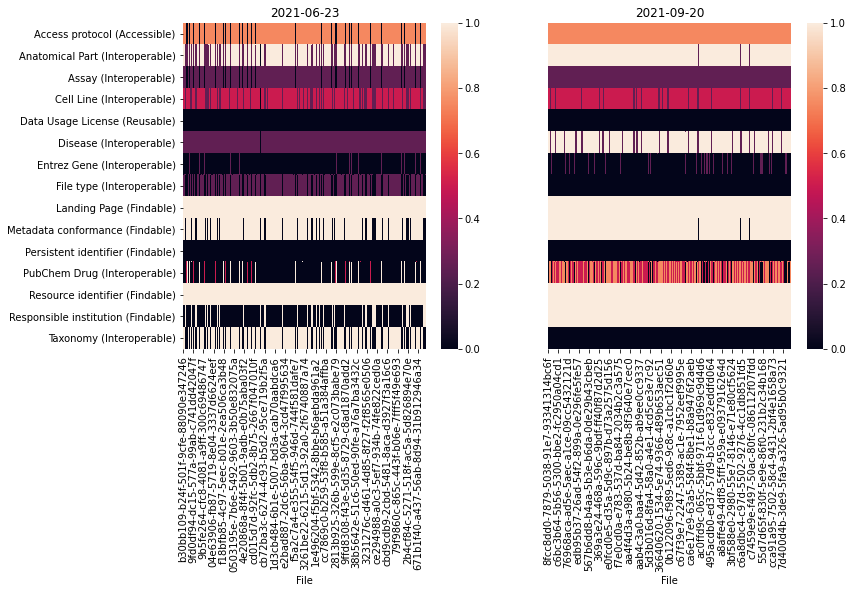

# LINCS FAIR Assessment Summary
We investigate the assessment results using the [C2M2 assessment](https://github.com/nih-cfde/FAIR/tree/master/Demos/FAIRAssessment/c2m2)
on the LINCS metadata C2M2 serializations and a custom [FAIR Assessment](https://github.com/nih-cfde/LINCS-metadata/tree/main/FAIRAssessment/assessment) directly on the LINCS portal metadata.

## Step 1. Perform FAIR Assessement on LINCS C2M2 Datapackage using [C2M2 assessment](https://github.com/nih-cfde/FAIR/tree/master/Demos/FAIRAssessment/c2m2).

NOTE: Also possible via the [Appyter](https://appyters.maayanlab.cloud/#/?q=cfde).

```bash
# Get LINCS-metadata
git clone https://github.com/nih-cfde/LINCS-metadata.git
# Get C2M2 Assessment
git clone https://github.com/nih-cfde/FAIR.git
# Perform C2M2 assessment on LINCS-metadata
python3.8 ./FAIR/Demos/FAIRAssessment/c2m2/assess.py -i ./LINCS-metadata/c2m2_level1/datapackage.json -o assessments/c2m2/$(date +%Y-%m-%d).jsonl
```


```python
import json
import requests
import pandas as pd
import seaborn as sns
from matplotlib import pyplot as plt
from pathlib import Path

def get_first(obj, *K):
  for k in K:
    if obj.get(k):
      return obj[k]
  return None

def sorted_indices(df):
  return (
    df
      .reindex(sorted(df.index), axis=0)
      .reindex(sorted(df.columns), axis=1)
  )
```


```python
metric_id_to_name = {
  27: 'PI Contact (Reusable)',
  104: 'Persistent identifier (Findable)',
  106: 'Metadata conformance (Findable)',
  108: 'Resource identifier (Findable)',
  110: 'Access protocol (Accessible)',
  116: 'Data Usage License (Reusable)',
  136: 'Program name (Findable)',
  137: 'Project name (Findable)',
  138: 'Responsible institution (Findable)',
  139: 'Assay (Interoperable)',
  140: 'Anatomical Part (Interoperable)',
  141: 'Disease (Interoperable)',
  142: 'File type (Interoperable)',
  143: 'Taxonomy (Interoperable)',
  144: 'Cell Line (Interoperable)',
  145: 'Landing Page (Findable)',
  310: 'PubChem Drug (Interoperable)',
  311: 'Entrez Gene (Interoperable)',
}
```


```python
def preprocess_c2m2(assessment, answer):
  ''' Flatten assessment/answer into something introspectable with a pandas dataframe
  '''
  import re
  if type(answer['metric']['@id']) == list:
    principle = re.match(r'^.+\((.+)\)$', metric_id_to_name[answer['metric']['@id']][0]).group(1)
  else:
    principle = re.match(r'^.+\((.+)\)$', metric_id_to_name[answer['metric']['@id']]).group(1)
  #
  return {
    'id': assessment['id'],
    'target': assessment['id'],
    'title': (assessment['target']['filename'] + ' (' + assessment['id'] + ')') if assessment['target'].get('filename') else assessment['id'],
    'metric_id': answer['metric']['@id'],
    'metric': metric_id_to_name[answer['metric']['@id']],
    'principle': principle,
    'value': answer['answer'].get('value', 0),
    'comment': answer['answer'].get('comment', ''),
    'url_comment': answer['answer'].get('url_comment', ''),
  }

c2m2 = pd.DataFrame([
    dict(preprocess_c2m2(assessment, answer), label=f.stem)
    for f in Path('assessments/c2m2/').glob('*.jsonl')
    for assessment in map(json.loads, f.open())
    if assessment and assessment.get('answers')
    for answer in assessment['answers']
])

c2m2
```


<div>
<style scoped>
    .dataframe tbody tr th:only-of-type {
        vertical-align: middle;
    }

    .dataframe tbody tr th {
        vertical-align: top;
    }

    .dataframe thead th {
        text-align: right;
    }
</style>
<table border="1" class="dataframe">
  <thead>
    <tr style="text-align: right;">
      <th></th>
      <th>id</th>
      <th>target</th>
      <th>title</th>
      <th>metric_id</th>
      <th>metric</th>
      <th>principle</th>
      <th>value</th>
      <th>comment</th>
      <th>url_comment</th>
      <th>label</th>
    </tr>
  </thead>
  <tbody>
    <tr>
      <th>0</th>
      <td>http://www.lincsproject.org/LDS-1176</td>
      <td>http://www.lincsproject.org/LDS-1176</td>
      <td>LDS-1176_1.1.tar.gz (http://www.lincsproject.o...</td>
      <td>106</td>
      <td>Metadata conformance (Findable)</td>
      <td>Findable</td>
      <td>0.807143</td>
      <td>Computed based on completeness of file (0.80) ...</td>
      <td></td>
      <td>2021-06-23</td>
    </tr>
    <tr>
      <th>1</th>
      <td>http://www.lincsproject.org/LDS-1176</td>
      <td>http://www.lincsproject.org/LDS-1176</td>
      <td>LDS-1176_1.1.tar.gz (http://www.lincsproject.o...</td>
      <td>136</td>
      <td>Program name (Findable)</td>
      <td>Findable</td>
      <td>1.000000</td>
      <td>Identified known program LINCS</td>
      <td></td>
      <td>2021-06-23</td>
    </tr>
    <tr>
      <th>2</th>
      <td>http://www.lincsproject.org/LDS-1176</td>
      <td>http://www.lincsproject.org/LDS-1176</td>
      <td>LDS-1176_1.1.tar.gz (http://www.lincsproject.o...</td>
      <td>137</td>
      <td>Project name (Findable)</td>
      <td>Findable</td>
      <td>0.000000</td>
      <td>No project found</td>
      <td></td>
      <td>2021-06-23</td>
    </tr>
    <tr>
      <th>3</th>
      <td>http://www.lincsproject.org/LDS-1176</td>
      <td>http://www.lincsproject.org/LDS-1176</td>
      <td>LDS-1176_1.1.tar.gz (http://www.lincsproject.o...</td>
      <td>27</td>
      <td>PI Contact (Reusable)</td>
      <td>Reusable</td>
      <td>0.750000</td>
      <td>Contact email found, possibly PI</td>
      <td></td>
      <td>2021-06-23</td>
    </tr>
    <tr>
      <th>4</th>
      <td>http://www.lincsproject.org/LDS-1176</td>
      <td>http://www.lincsproject.org/LDS-1176</td>
      <td>LDS-1176_1.1.tar.gz (http://www.lincsproject.o...</td>
      <td>138</td>
      <td>Responsible institution (Findable)</td>
      <td>Findable</td>
      <td>0.000000</td>
      <td>No information about the contributing institut...</td>
      <td></td>
      <td>2021-06-23</td>
    </tr>
    <tr>
      <th>...</th>
      <td>...</td>
      <td>...</td>
      <td>...</td>
      <td>...</td>
      <td>...</td>
      <td>...</td>
      <td>...</td>
      <td>...</td>
      <td>...</td>
      <td>...</td>
    </tr>
    <tr>
      <th>49275180</th>
      <td>https://www.lincsproject.org/LDS-1069</td>
      <td>https://www.lincsproject.org/LDS-1069</td>
      <td>LDS-1069_1.1.tar.gz (https://www.lincsproject....</td>
      <td>143</td>
      <td>Taxonomy (Interoperable)</td>
      <td>Interoperable</td>
      <td>1.000000</td>
      <td>Taxonomy is present and validated in ncbi</td>
      <td>NCBI:txid9606</td>
      <td>2021-08-23</td>
    </tr>
    <tr>
      <th>49275181</th>
      <td>https://www.lincsproject.org/LDS-1069</td>
      <td>https://www.lincsproject.org/LDS-1069</td>
      <td>LDS-1069_1.1.tar.gz (https://www.lincsproject....</td>
      <td>116</td>
      <td>Data Usage License (Reusable)</td>
      <td>Reusable</td>
      <td>0.000000</td>
      <td>No information about data usage licenses are d...</td>
      <td></td>
      <td>2021-08-23</td>
    </tr>
    <tr>
      <th>49275182</th>
      <td>https://www.lincsproject.org/LDS-1069</td>
      <td>https://www.lincsproject.org/LDS-1069</td>
      <td>LDS-1069_1.1.tar.gz (https://www.lincsproject....</td>
      <td>104</td>
      <td>Persistent identifier (Findable)</td>
      <td>Findable</td>
      <td>0.500000</td>
      <td>A persistent_id was identified but it is not a...</td>
      <td>https://lincsportal.ccs.miami.edu/datasets/vie...</td>
      <td>2021-08-23</td>
    </tr>
    <tr>
      <th>49275183</th>
      <td>https://www.lincsproject.org/LDS-1069</td>
      <td>https://www.lincsproject.org/LDS-1069</td>
      <td>LDS-1069_1.1.tar.gz (https://www.lincsproject....</td>
      <td>108</td>
      <td>Resource identifier (Findable)</td>
      <td>Findable</td>
      <td>1.000000</td>
      <td>An id and namespace were provided for the reso...</td>
      <td>LDS-1069 https://www.lincsproject.org/</td>
      <td>2021-08-23</td>
    </tr>
    <tr>
      <th>49275184</th>
      <td>https://www.lincsproject.org/LDS-1069</td>
      <td>https://www.lincsproject.org/LDS-1069</td>
      <td>LDS-1069_1.1.tar.gz (https://www.lincsproject....</td>
      <td>145</td>
      <td>Landing Page (Findable)</td>
      <td>Findable</td>
      <td>0.000000</td>
      <td>Error:</td>
      <td>https://lincsportal.ccs.miami.edu/datasets/vie...</td>
      <td>2021-08-23</td>
    </tr>
  </tbody>
</table>
<p>49275185 rows × 10 columns</p>
</div>


```python
c2m2.pivot_table(index='metric', columns='label', values='value', aggfunc='mean')
```


<div>
<style scoped>
    .dataframe tbody tr th:only-of-type {
        vertical-align: middle;
    }

    .dataframe tbody tr th {
        vertical-align: top;
    }

    .dataframe thead th {
        text-align: right;
    }
</style>
<table border="1" class="dataframe">
  <thead>
    <tr style="text-align: right;">
      <th>label</th>
      <th>2021-06-23</th>
      <th>2021-08-23</th>
    </tr>
    <tr>
      <th>metric</th>
      <th></th>
      <th></th>
    </tr>
  </thead>
  <tbody>
    <tr>
      <th>Access protocol (Accessible)</th>
      <td>0.000000</td>
      <td>0.000000</td>
    </tr>
    <tr>
      <th>Anatomical Part (Interoperable)</th>
      <td>0.863031</td>
      <td>0.989584</td>
    </tr>
    <tr>
      <th>Assay (Interoperable)</th>
      <td>0.500007</td>
      <td>0.500007</td>
    </tr>
    <tr>
      <th>Cell Line (Interoperable)</th>
      <td>0.000000</td>
      <td>0.000000</td>
    </tr>
    <tr>
      <th>Data Usage License (Reusable)</th>
      <td>0.000000</td>
      <td>0.000000</td>
    </tr>
    <tr>
      <th>Disease (Interoperable)</th>
      <td>0.000000</td>
      <td>0.000000</td>
    </tr>
    <tr>
      <th>File type (Interoperable)</th>
      <td>0.750000</td>
      <td>0.750000</td>
    </tr>
    <tr>
      <th>Landing Page (Findable)</th>
      <td>0.983531</td>
      <td>0.983449</td>
    </tr>
    <tr>
      <th>Metadata conformance (Findable)</th>
      <td>0.856166</td>
      <td>0.847695</td>
    </tr>
    <tr>
      <th>PI Contact (Reusable)</th>
      <td>0.750000</td>
      <td>0.750000</td>
    </tr>
    <tr>
      <th>Persistent identifier (Findable)</th>
      <td>0.500000</td>
      <td>0.500000</td>
    </tr>
    <tr>
      <th>Program name (Findable)</th>
      <td>1.000000</td>
      <td>1.000000</td>
    </tr>
    <tr>
      <th>Project name (Findable)</th>
      <td>0.000000</td>
      <td>0.000000</td>
    </tr>
    <tr>
      <th>Resource identifier (Findable)</th>
      <td>1.000000</td>
      <td>1.000000</td>
    </tr>
    <tr>
      <th>Responsible institution (Findable)</th>
      <td>0.000000</td>
      <td>0.000000</td>
    </tr>
    <tr>
      <th>Taxonomy (Interoperable)</th>
      <td>1.000000</td>
      <td>1.000000</td>
    </tr>
  </tbody>
</table>
</div>


```python
# Looking at increase in anatomic part
(
  c2m2[c2m2['metric'] == 'Anatomical Part (Interoperable)']
    .groupby('label')['url_comment']
    .value_counts()
    .unstack()
    .fillna(0)
    .T
    .sort_values('2021-08-23')
)
```


<div>
<style scoped>
    .dataframe tbody tr th:only-of-type {
        vertical-align: middle;
    }

    .dataframe tbody tr th {
        vertical-align: top;
    }

    .dataframe thead th {
        text-align: right;
    }
</style>
<table border="1" class="dataframe">
  <thead>
    <tr style="text-align: right;">
      <th>label</th>
      <th>2021-06-23</th>
      <th>2021-08-23</th>
    </tr>
    <tr>
      <th>url_comment</th>
      <th></th>
      <th></th>
    </tr>
  </thead>
  <tbody>
    <tr>
      <th>UBERON:0003889</th>
      <td>6.0</td>
      <td>6.0</td>
    </tr>
    <tr>
      <th>UBERON:0000029</th>
      <td>8.0</td>
      <td>8.0</td>
    </tr>
    <tr>
      <th>UBERON:0002397</th>
      <td>8.0</td>
      <td>8.0</td>
    </tr>
    <tr>
      <th>UBERON:0000056</th>
      <td>11.0</td>
      <td>11.0</td>
    </tr>
    <tr>
      <th>UBERON:0002110</th>
      <td>11.0</td>
      <td>11.0</td>
    </tr>
    <tr>
      <th>...</th>
      <td>...</td>
      <td>...</td>
    </tr>
    <tr>
      <th>UBERON:0002113</th>
      <td>123445.0</td>
      <td>123727.0</td>
    </tr>
    <tr>
      <th>UBERON:0002097</th>
      <td>110195.0</td>
      <td>128089.0</td>
    </tr>
    <tr>
      <th>UBERON:0002048</th>
      <td>168048.0</td>
      <td>187041.0</td>
    </tr>
    <tr>
      <th>UBERON:0002367</th>
      <td>219340.0</td>
      <td>230738.0</td>
    </tr>
    <tr>
      <th>UBERON:0000310</th>
      <td>221092.0</td>
      <td>234091.0</td>
    </tr>
  </tbody>
</table>
<p>61 rows × 2 columns</p>
</div>


```python
# The types of errors causing landing page to not be 1
(
  c2m2[c2m2['metric'] == 'Landing Page (Findable)']
    .groupby('label')['comment']
    .value_counts()
    .unstack()
    .fillna(0)
    .T
)
```


<div>
<style scoped>
    .dataframe tbody tr th:only-of-type {
        vertical-align: middle;
    }

    .dataframe tbody tr th {
        vertical-align: top;
    }

    .dataframe thead th {
        text-align: right;
    }
</style>
<table border="1" class="dataframe">
  <thead>
    <tr style="text-align: right;">
      <th>label</th>
      <th>2021-06-23</th>
      <th>2021-08-23</th>
    </tr>
    <tr>
      <th>comment</th>
      <th></th>
      <th></th>
    </tr>
  </thead>
  <tbody>
    <tr>
      <th>Error:</th>
      <td>0.0</td>
      <td>506.0</td>
    </tr>
    <tr>
      <th>valid and HEAD reports 200</th>
      <td>1423118.0</td>
      <td>1422900.0</td>
    </tr>
    <tr>
      <th>valid url but HEAD reported 404</th>
      <td>31939.0</td>
      <td>31420.0</td>
    </tr>
    <tr>
      <th>valid url but HEAD reported 500</th>
      <td>12.0</td>
      <td>10.0</td>
    </tr>
  </tbody>
</table>
</div>


## Step 2. Perform FAIR Assessement on LINCS Portal Data using [LINCS assessment](https://github.com/nih-cfde/LINCS-metadata/tree/main/FAIRAssessment/assessment).
```bash
# Get LINCS-metadata
git clone https://github.com/nih-cfde/LINCS-metadata.git
# Grab LINCS Portal Data
mkdir -p data
curl https://maayanlab.cloud/sigcom-lincs/metadata-api/libraries | jq -rc '.[]' > data/libraries.jsonl
curl https://maayanlab.cloud/sigcom-lincs/metadata-api/signatures | jq -rc '.[]' > data/signatures.jsonl
# Perform assessment on LINCS-metadata
python3.8 ./LINCS-metadata/FAIRAssessment/assessment/assess.py \
  -s data/signatures.jsonl \
  -l data/libraries.jsonl \
  -o assessments/lincs/$(date +%Y-%m-%d).jsonl
```


```python
# get lincs library metadata from sigcom-lincs
lincs_libraries = {
    library['id']: library
    for library in requests.get('https://maayanlab.cloud/sigcom-lincs/metadata-api/libraries').json()
}
```


```python
# Load all lincs assessment results
lincs = pd.DataFrame([
    {
        'label': f.stem,
        'metric_id': answer['metric']['@id'],
        'metric': metric_id_to_name[answer['metric']['@id']],
        'answer_value': answer['answer'].get('value'),
        'answer_comment': answer['answer'].get('comment'),
        'answer_url_comment': answer['answer'].get('url_comment'),
        'target_id': assessment['target']['id'],
        'target_library_id': assessment['target']['library']['id'],
        'target_library': lincs_libraries[assessment['target']['library']['id']]['dataset'],
    }
    for f in Path('./assessments/lincs/').glob('*.jsonl')
    for assessment in map(json.loads, f.open())
    for answer in assessment['answers']
])

lincs
```


<div>
<style scoped>
    .dataframe tbody tr th:only-of-type {
        vertical-align: middle;
    }

    .dataframe tbody tr th {
        vertical-align: top;
    }

    .dataframe thead th {
        text-align: right;
    }
</style>
<table border="1" class="dataframe">
  <thead>
    <tr style="text-align: right;">
      <th></th>
      <th>label</th>
      <th>metric_id</th>
      <th>metric</th>
      <th>answer_value</th>
      <th>answer_comment</th>
      <th>answer_url_comment</th>
      <th>target_id</th>
      <th>target_library_id</th>
      <th>target_library</th>
    </tr>
  </thead>
  <tbody>
    <tr>
      <th>0</th>
      <td>2021-06-23</td>
      <td>106</td>
      <td>Metadata conformance (Findable)</td>
      <td>1.00</td>
      <td>Instance validates against its own validator</td>
      <td>None</td>
      <td>beae56c1-ccb7-5420-b019-2264722c61a6</td>
      <td>54198d6e-fe17-5ef8-91ac-02b425761653</td>
      <td>l1000_cp</td>
    </tr>
    <tr>
      <th>1</th>
      <td>2021-06-23</td>
      <td>138</td>
      <td>Responsible institution (Findable)</td>
      <td>0.00</td>
      <td>Center name is not present in metadata</td>
      <td>None</td>
      <td>beae56c1-ccb7-5420-b019-2264722c61a6</td>
      <td>54198d6e-fe17-5ef8-91ac-02b425761653</td>
      <td>l1000_cp</td>
    </tr>
    <tr>
      <th>2</th>
      <td>2021-06-23</td>
      <td>110</td>
      <td>Access protocol (Accessible)</td>
      <td>0.75</td>
      <td>Access protocol (https) is encoded in uri</td>
      <td>#/meta/persistent_id</td>
      <td>beae56c1-ccb7-5420-b019-2264722c61a6</td>
      <td>54198d6e-fe17-5ef8-91ac-02b425761653</td>
      <td>l1000_cp</td>
    </tr>
    <tr>
      <th>3</th>
      <td>2021-06-23</td>
      <td>139</td>
      <td>Assay (Interoperable)</td>
      <td>0.25</td>
      <td>Assay found but not verified in OBI.</td>
      <td>OBI:0002965</td>
      <td>beae56c1-ccb7-5420-b019-2264722c61a6</td>
      <td>54198d6e-fe17-5ef8-91ac-02b425761653</td>
      <td>l1000_cp</td>
    </tr>
    <tr>
      <th>4</th>
      <td>2021-06-23</td>
      <td>140</td>
      <td>Anatomical Part (Interoperable)</td>
      <td>1.00</td>
      <td>Ontological IRI for anatomy found in UBERON.</td>
      <td>UBERON:0002367</td>
      <td>beae56c1-ccb7-5420-b019-2264722c61a6</td>
      <td>54198d6e-fe17-5ef8-91ac-02b425761653</td>
      <td>l1000_cp</td>
    </tr>
    <tr>
      <th>...</th>
      <td>...</td>
      <td>...</td>
      <td>...</td>
      <td>...</td>
      <td>...</td>
      <td>...</td>
      <td>...</td>
      <td>...</td>
      <td>...</td>
    </tr>
    <tr>
      <th>35272097</th>
      <td>2021-09-20</td>
      <td>144</td>
      <td>Cell Line (Interoperable)</td>
      <td>0.50</td>
      <td>Ontological IRI not found, but cell line found...</td>
      <td>U2OS</td>
      <td>bdb99682-fd7d-573c-8139-625283fb1536</td>
      <td>8f1ff550-ece8-591d-a213-2763f854c008</td>
      <td>l1000_shRNA</td>
    </tr>
    <tr>
      <th>35272098</th>
      <td>2021-09-20</td>
      <td>116</td>
      <td>Data Usage License (Reusable)</td>
      <td>0.00</td>
      <td>No information about data usage licenses are d...</td>
      <td>None</td>
      <td>bdb99682-fd7d-573c-8139-625283fb1536</td>
      <td>8f1ff550-ece8-591d-a213-2763f854c008</td>
      <td>l1000_shRNA</td>
    </tr>
    <tr>
      <th>35272099</th>
      <td>2021-09-20</td>
      <td>104</td>
      <td>Persistent identifier (Findable)</td>
      <td>0.00</td>
      <td>No persistent_id defined</td>
      <td>None</td>
      <td>bdb99682-fd7d-573c-8139-625283fb1536</td>
      <td>8f1ff550-ece8-591d-a213-2763f854c008</td>
      <td>l1000_shRNA</td>
    </tr>
    <tr>
      <th>35272100</th>
      <td>2021-09-20</td>
      <td>108</td>
      <td>Resource identifier (Findable)</td>
      <td>1.00</td>
      <td>A resource id is present</td>
      <td>bdb99682-fd7d-573c-8139-625283fb1536</td>
      <td>bdb99682-fd7d-573c-8139-625283fb1536</td>
      <td>8f1ff550-ece8-591d-a213-2763f854c008</td>
      <td>l1000_shRNA</td>
    </tr>
    <tr>
      <th>35272101</th>
      <td>2021-09-20</td>
      <td>145</td>
      <td>Landing Page (Findable)</td>
      <td>1.00</td>
      <td>valid and GET reports 200</td>
      <td>https://ldp3.cloud/#/Signatures/bdb99682-fd7d-...</td>
      <td>bdb99682-fd7d-573c-8139-625283fb1536</td>
      <td>8f1ff550-ece8-591d-a213-2763f854c008</td>
      <td>l1000_shRNA</td>
    </tr>
  </tbody>
</table>
<p>35272102 rows × 9 columns</p>
</div>


```python
# Take a sample of the individual item answers
labels = lincs['label'].unique(); labels.sort()
metrics = lincs['metric'].unique(); metrics.sort()
fig, axes = plt.subplots(1, len(labels), figsize=(6*len(labels), 6))
for i, (label, ax) in enumerate(zip(labels, axes)):
  records = lincs[lincs['label'] == label]
  answer_matrix = records.groupby(['target_id', 'metric'])['answer_value'].mean().unstack()
  sns.heatmap(sorted_indices(answer_matrix.sample(1000).fillna(0).T), yticklabels=(i == 0), xticklabels=False, ax=ax)
  ax.set_ylabel('')
  ax.set_xlabel('File')
  ax.set_title(label)
plt.show()
```


```python
# See average answer per library
labels = lincs['label'].unique(); labels.sort()
fig, axes = plt.subplots(1, len(labels), figsize=(6*len(labels), 6))
for i, (label, ax) in enumerate(zip(labels, axes)):
  records = lincs[lincs['label'] == label]
  answer_matrix = records.groupby(['target_library', 'metric'])['answer_value'].mean().unstack()
  sns.heatmap(sorted_indices(answer_matrix.T), yticklabels=(i == 0), ax=ax)
  ax.tick_params(left=False, bottom=True)
  ax.set_ylabel('')
  ax.set_title(label)
plt.show()
```





## Step 3. Compare assessment on C2M2 with SigCom-LINCS Assessment


```python
lincs_grid = lincs.pivot_table(columns='metric', index='label', values='answer_value', aggfunc='mean')
c2m2_grid = c2m2.pivot_table(columns='metric', index='label', values='value', aggfunc='mean')
# put NaNs wherever the grid columns don't overlap
for col in c2m2_grid.columns:
  if col not in lincs_grid.columns:
    lincs_grid[col] = float('nan')
for col in lincs_grid.columns:
  if col not in c2m2_grid.columns:
    c2m2_grid[col] = float('nan')
cols = list(set(c2m2_grid.columns) & set(lincs_grid.columns))
lincs_grid = lincs_grid[cols].T
c2m2_grid = c2m2_grid[cols].T

fig, (ax1, ax2) = plt.subplots(1, 2, figsize=(12, 6))
sns.heatmap(lincs_grid, annot=True, ax=ax1)
ax1.set_title('LINCS')
sns.heatmap(c2m2_grid, annot=True, yticklabels=False, ax=ax2)
ax2.set_title('C2M2')
ax2.set_ylabel('')
plt.show()
```


## Step 4. Prepare Current Assessment Summaries for FAIRshake
These computational assessments are extremely granular and useful for
in-depth per-file/signature review. However, our data is highly uniform
within each library, and as such, it makes sense to generate per-library
summary assessments and submitting these to FAIRshake.

Effectively, the heatmaps we looked at above will be registered with FAIRshake
for external review and historical archiving. These per-library results
will also be available as FAIR Insignias on SigCom-LINCS with the help of FAIRshake.


```python
from collections import OrderedDict
fairshake = OrderedDict()
```

### SigCom-LINCS Assessments


```python
labels = lincs['label'].unique(); labels.sort()
current = lincs[lincs['label'] == labels[-1]]
current
```


<div>
<style scoped>
    .dataframe tbody tr th:only-of-type {
        vertical-align: middle;
    }

    .dataframe tbody tr th {
        vertical-align: top;
    }

    .dataframe thead th {
        text-align: right;
    }
</style>
<table border="1" class="dataframe">
  <thead>
    <tr style="text-align: right;">
      <th></th>
      <th>label</th>
      <th>metric_id</th>
      <th>metric</th>
      <th>answer_value</th>
      <th>answer_comment</th>
      <th>answer_url_comment</th>
      <th>target_id</th>
      <th>target_library_id</th>
      <th>target_library</th>
    </tr>
  </thead>
  <tbody>
    <tr>
      <th>20439802</th>
      <td>2021-09-20</td>
      <td>106</td>
      <td>Metadata conformance (Findable)</td>
      <td>1.00</td>
      <td>Instance validates against its own validator</td>
      <td>None</td>
      <td>aeb0f4f8-5453-52c1-a39b-c9788d6fba8a</td>
      <td>b953025a-4356-5cc8-b6e3-dcf2f4f85420</td>
      <td>l1000_siRNA</td>
    </tr>
    <tr>
      <th>20439803</th>
      <td>2021-09-20</td>
      <td>138</td>
      <td>Responsible institution (Findable)</td>
      <td>1.00</td>
      <td>Center name is present in metadata</td>
      <td>None</td>
      <td>aeb0f4f8-5453-52c1-a39b-c9788d6fba8a</td>
      <td>b953025a-4356-5cc8-b6e3-dcf2f4f85420</td>
      <td>l1000_siRNA</td>
    </tr>
    <tr>
      <th>20439804</th>
      <td>2021-09-20</td>
      <td>110</td>
      <td>Access protocol (Accessible)</td>
      <td>0.75</td>
      <td>Access protocol (https) is encoded in uri</td>
      <td>#/meta/persistent_id</td>
      <td>aeb0f4f8-5453-52c1-a39b-c9788d6fba8a</td>
      <td>b953025a-4356-5cc8-b6e3-dcf2f4f85420</td>
      <td>l1000_siRNA</td>
    </tr>
    <tr>
      <th>20439805</th>
      <td>2021-09-20</td>
      <td>110</td>
      <td>Access protocol (Accessible)</td>
      <td>0.75</td>
      <td>Access protocol (https) is encoded in uri</td>
      <td>#/library/meta/datalevel_5</td>
      <td>aeb0f4f8-5453-52c1-a39b-c9788d6fba8a</td>
      <td>b953025a-4356-5cc8-b6e3-dcf2f4f85420</td>
      <td>l1000_siRNA</td>
    </tr>
    <tr>
      <th>20439806</th>
      <td>2021-09-20</td>
      <td>139</td>
      <td>Assay (Interoperable)</td>
      <td>0.25</td>
      <td>Assay found but not verified in OBI.</td>
      <td>L1000 mRNA profiling assay</td>
      <td>aeb0f4f8-5453-52c1-a39b-c9788d6fba8a</td>
      <td>b953025a-4356-5cc8-b6e3-dcf2f4f85420</td>
      <td>l1000_siRNA</td>
    </tr>
    <tr>
      <th>...</th>
      <td>...</td>
      <td>...</td>
      <td>...</td>
      <td>...</td>
      <td>...</td>
      <td>...</td>
      <td>...</td>
      <td>...</td>
      <td>...</td>
    </tr>
    <tr>
      <th>35272097</th>
      <td>2021-09-20</td>
      <td>144</td>
      <td>Cell Line (Interoperable)</td>
      <td>0.50</td>
      <td>Ontological IRI not found, but cell line found...</td>
      <td>U2OS</td>
      <td>bdb99682-fd7d-573c-8139-625283fb1536</td>
      <td>8f1ff550-ece8-591d-a213-2763f854c008</td>
      <td>l1000_shRNA</td>
    </tr>
    <tr>
      <th>35272098</th>
      <td>2021-09-20</td>
      <td>116</td>
      <td>Data Usage License (Reusable)</td>
      <td>0.00</td>
      <td>No information about data usage licenses are d...</td>
      <td>None</td>
      <td>bdb99682-fd7d-573c-8139-625283fb1536</td>
      <td>8f1ff550-ece8-591d-a213-2763f854c008</td>
      <td>l1000_shRNA</td>
    </tr>
    <tr>
      <th>35272099</th>
      <td>2021-09-20</td>
      <td>104</td>
      <td>Persistent identifier (Findable)</td>
      <td>0.00</td>
      <td>No persistent_id defined</td>
      <td>None</td>
      <td>bdb99682-fd7d-573c-8139-625283fb1536</td>
      <td>8f1ff550-ece8-591d-a213-2763f854c008</td>
      <td>l1000_shRNA</td>
    </tr>
    <tr>
      <th>35272100</th>
      <td>2021-09-20</td>
      <td>108</td>
      <td>Resource identifier (Findable)</td>
      <td>1.00</td>
      <td>A resource id is present</td>
      <td>bdb99682-fd7d-573c-8139-625283fb1536</td>
      <td>bdb99682-fd7d-573c-8139-625283fb1536</td>
      <td>8f1ff550-ece8-591d-a213-2763f854c008</td>
      <td>l1000_shRNA</td>
    </tr>
    <tr>
      <th>35272101</th>
      <td>2021-09-20</td>
      <td>145</td>
      <td>Landing Page (Findable)</td>
      <td>1.00</td>
      <td>valid and GET reports 200</td>
      <td>https://ldp3.cloud/#/Signatures/bdb99682-fd7d-...</td>
      <td>bdb99682-fd7d-573c-8139-625283fb1536</td>
      <td>8f1ff550-ece8-591d-a213-2763f854c008</td>
      <td>l1000_shRNA</td>
    </tr>
  </tbody>
</table>
<p>14832300 rows × 9 columns</p>
</div>


```python
# register digital objects
for library in current['target_library_id'].unique():
  title = get_first(
    lincs_libraries[library]['meta'],
    'title', 'libraryName', 'SourceID', 'description'
  )
  assert title is not None
  description = get_first(
      lincs_libraries[library]['meta'],
      'libraryInfo', 'description',
  )
  obj = {
    '@type': 'DigitalObject',
    'title': title,
    'url': '\n'.join(filter(None, [
        f"https://maayanlab.cloud/sigcom-lincs/#/Datasets/{library}",
        lincs_libraries[library]['meta'].get('url_prefix'),
    ] + [
        v['link']
        for k, v in lincs_libraries[library]['meta'].items()
        if type(v) == dict and 'link' in v
    ])),
    'rubrics': [107], # LINCS Rubric
    'projects': [92], # LINCS CFDE Assessments
  }
  if description != title and description:
    obj['description'] = description
  fairshake[(library, 'DigitalObject')] = obj
```


```python
answer_matrix = current.groupby(['target_library_id', 'metric_id'])['answer_value'].mean().unstack()
for library, assessment in answer_matrix.iterrows():
  fairshake[(library, 'Assessment')] = {
    '@type': 'Assessment',
    'methodology': 'auto',
    'published': True,
    'target': { '@id': (library, 'DigitalObject') },
    'rubric': 107, # LINCS Rubric
    'project': 92, # LINCS CFDE Assessments
  }
  # fairshake[(library, 'assessment')] 
  for metric, answer in assessment.iteritems():
    fairshake[(library, metric, 'Answer')] = {
      '@type': 'Answer',
      'assessment': { '@id': (library, 'Assessment') },
      'metric': metric,
      'answer': None if pd.isna(answer) else answer,
    }
```

## Submit to FAIRshake
